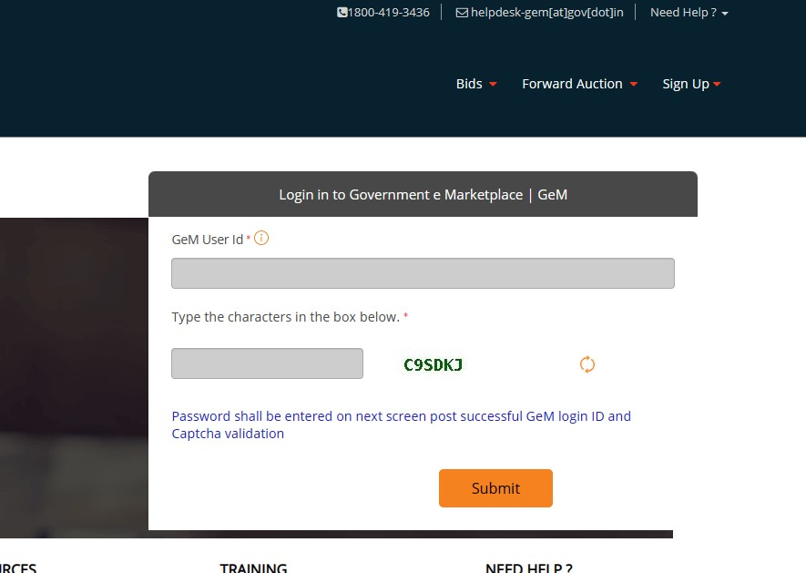
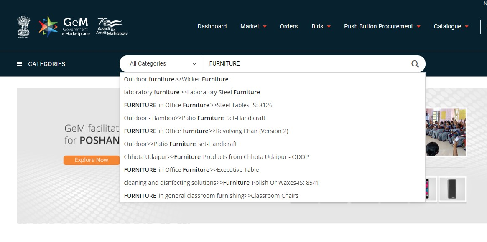
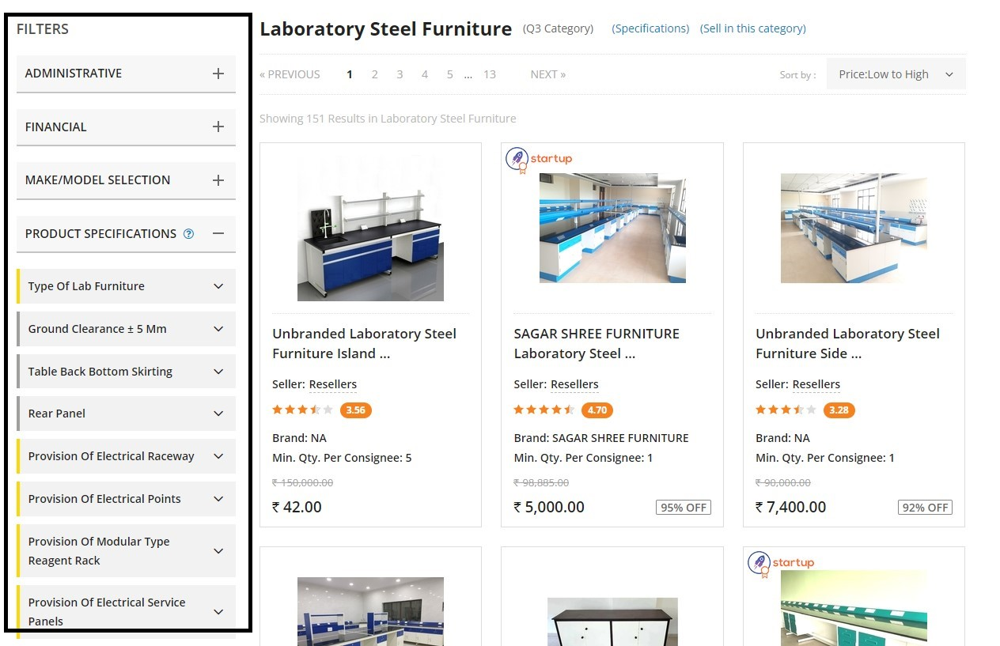
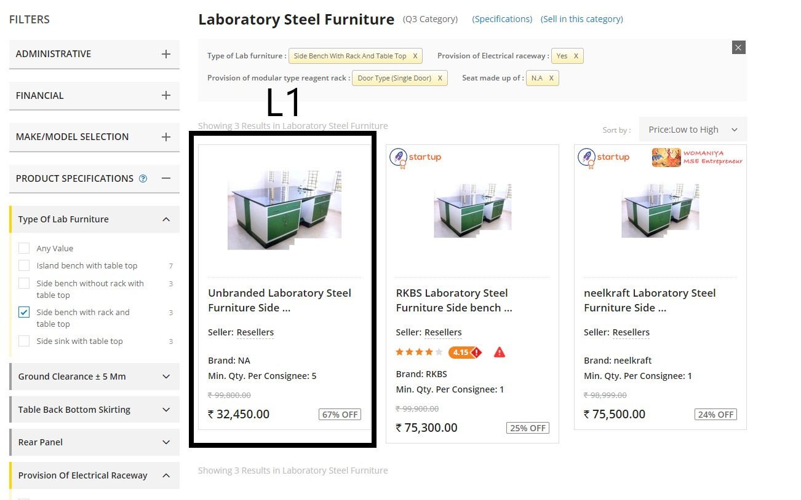

Buyers have two ways to procure goods and services from the Gem Portal. One is through Bid/RA and the other is through **Direct Purchase**.

The buyer can directly purchase goods or services up to Rs 25000. However, for orders valued between Rs 25000 and Rs 500000, the buyer must compare three different OEMs or service providers. These providers must meet the requirements for quality, quantity, specifications, and delivery period.

<!--truncate-->

After they enter all of their requirements, such as product specifications, seller ratings, delivery period, etc, the system will recommend the L1 product that matches all the requirements. **Only the L1 system recommendation can be added to the cart by the buyer**.

## What is L1?
**L1 means Lowest One**. GeM was built to make public procurement more transparent and efficient. Any order through Bid/RA or L1 purchase can only be placed with the seller who has quoted Lowest Rate except any seller having preference.

Today we are getting ready to **prepare L1 on GeM using a seller account**. We will only find the required filter to get our product L1 and share that comparison filter with Buyer so that we can receive the order.

## Pre-requisites
Prior to preparing L1 comparisons, you must have these details.

1. Category/Product
2. Quantity
3. Rate
4. Delivery Location

## Steps for L1 Comparison
Below are the basic steps to choose the right filter to get your product as **L1 on GeM**.

1. Login and go to the marketplace
2. Find the category
3. Choosing the right filter

### Login and go to the marketplace
Navigate to the official website of GeM and find the Login button on the top right of the screen.

Enter your GeM Seller User ID and Password to get logged in.

### Find the category
Once you are logged in, click on the Market link to navigate to the GeM Marketplace or you can directly access it from here.

You can enter the category name or words related to your products or services to select which category your products or services belong to.

### Choosing the right filter
On the left-hand side, you will see a section called Filter with 4 options: 1. ADMINISTRATIVE, 2. FINANCIAL, 3. MAKE/MODEL SELECTION, 4. PRODUCT SPECIFICATIONS (If you are unable to see these filters, please make sure you are logged in).

You only need to work on the Product Specification section. Upon clicking the Product Specification section, you will see two types of filters: one is yellow (known as Golden Parameters) and the other is gray (known as Silver Parameters).

Now, you have to choose the right combination of golden parameters (only golden parameters) for your product or service when it is L1. When comparing your products, you should compare them with a minimum of 3 OEMs or service providers.

Once you get the filters, share that filter with the buyer so that he/she can place the order with you without hassle :)

:::info Info

L1 comparison can be done using a Seller or Buyer account on GeM only the difference is, seller can't select consignee location at the time of applying filters. Therefore, they need to periodically check the availability of products.

:::