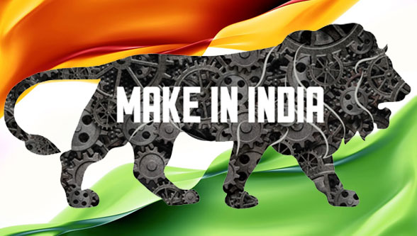

[**The Make in India**](https://www.makeinindia.com/) initiative was launched by the **Prime Minister** in **September 2014** as part of a wider set of nation-building initiatives. Devised to transform India into a global design and manufacturing hub, Make in India was a timely response to a critical situation. By 2013, the much-hyped emerging markets bubble had burst, and India’s growth rate had fallen to its lowest level in a decade. The promise of the BRICS Nations (Brazil, Russia, India, China and South Africa) had faded, and India was tagged as one of the so-called ‘Fragile Five’.

<!--truncate-->

Global investors debated whether the world’s largest democracy was a risk or an opportunity. India’s 1.2 billion citizens questioned whether India was too big to succeed or too big to fail. India was on the brink of severe economic failure, desperately in need of a big push.

## About GeM
[**GEM (Government e-Marketplace)**](https://gem.gov.in/), is an online portal that was launched in August 2016 as part of the "Make in India" initiative.
GEM is a one-stop-shop for government procurement of goods and services, providing a platform for online procurement of common use goods and services by government departments, organizations, and state PSUs.

The "Make in India" initiative has helped in promoting domestic manufacturing and has increased the visibility of Indian products globally.

The inclusion of GEM as part of the initiative has helped in facilitating the procurement of goods and services from Indian manufacturers. This has led to increased demand for Indian products and helped create employment opportunities in India.

## Make In India Logo
The **Make in India logo** can be used by domestic and international companies, entrepreneurs, start-ups, and other organizations to promote the initiative and showcase their commitment to the cause. The use of the Make In India logo is strictly prohibited without permission from [DPIIT](https://dpiit.gov.in/). It can be used in various marketing and promotional activities such as advertisements, websites, brochures, and social media campaigns. The logo must not be displayed in any offensive or derogatory manner.

[Download Logo](img/make-in-india.jpg "download")

## Make In India Certificate / MII Certificate
Government has issued Public Procurement (Preference to Make in India) [PPP-MII] Order 2017 vide the Department for Promotion of Industry and Internal Trade (DPIIT) Order No.[P-45021/2/2017-B.E.-II dated 15.06.2017](https://dpiit.gov.in/sites/default/files/publicProcurement_MakeinIndia_31May2018.pdf) and subsequent revisions vide Order No. 45021/2/2017-PP(BE-II) dated 28.05.2018, 29.05.2019, 04.06.2020 and 16.09.2020 to encourage "Make in India" and to promote manufacturing and production of goods, services and works in India with a view to enhancing income and employment. This Order is issued pursuant to Rule 153 (iii) of the General Financial Rules 2017.

Make in India is an initiative by the government of India. Therefore, there is no provision to get a Make in India certificate. You only need to write a self declaration about the **local content value** and the **location where the local value has been added**.

<a href="/tools/make-in-india" class="button button--success button--md margin-horiz--sm">Generate Make In India Certificate</a>

## Make in India Purchase preference in GeM

As part of the "Make in India" initiative, the **Government e-Marketplace (GeM)** provides **purchase preference for products manufactured and services rendered by Indian suppliers**. This purchase preference is provided to promote and encourage domestic manufacturing and to help Indian companies participate in government procurement.

**GeM provides a purchase preference of 20% to Indian suppliers** who meet the minimum local content requirements. This means that if an Indian supplier meets the **minimum local content requirement** and their bid is within 20% of the lowest bid received from a foreign supplier, the Indian supplier will be given the contract.

The local content requirement varies by category of goods and services and is calculated as a percentage of the total cost of the product or service. For example, for some categories of goods, the local content requirement may be 50%. This means that 50% of the total cost of the product must be contributed by Indian suppliers.

:::info Local Suppliers

Class-I Local supplier

A supplier or service provider, whose goods, services or works offered for procurement, has local content equal to or more than 50%.

Class-II Local supplier

A supplier or service provider, whose goods, services or works offered for procurement, has local content more than 20% but less than 50%.

Non-Local supplier

A supplier or service provider, whose goods, services or works offered for procurement, has local content less than or equal to 20%.

:::